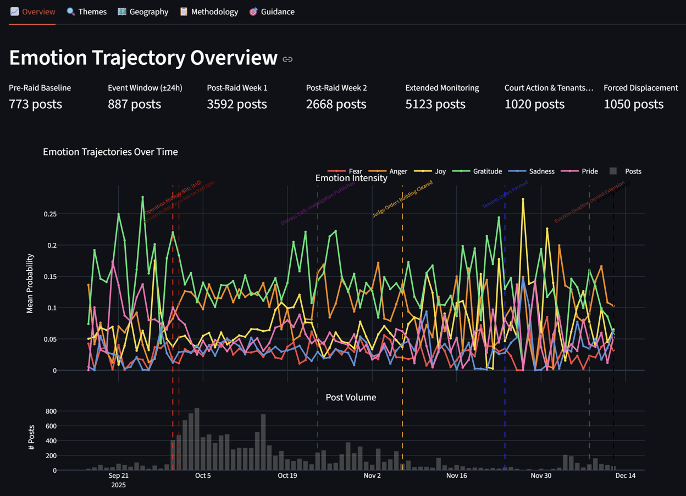
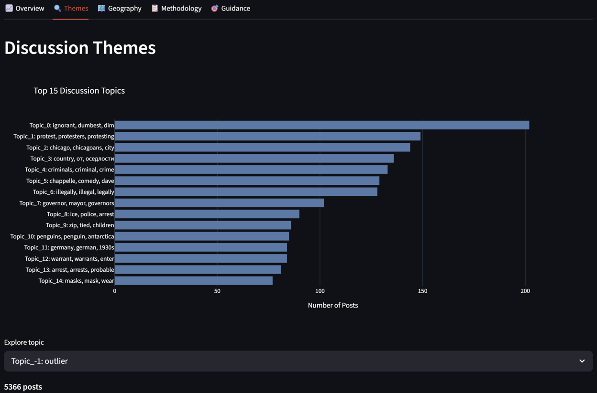
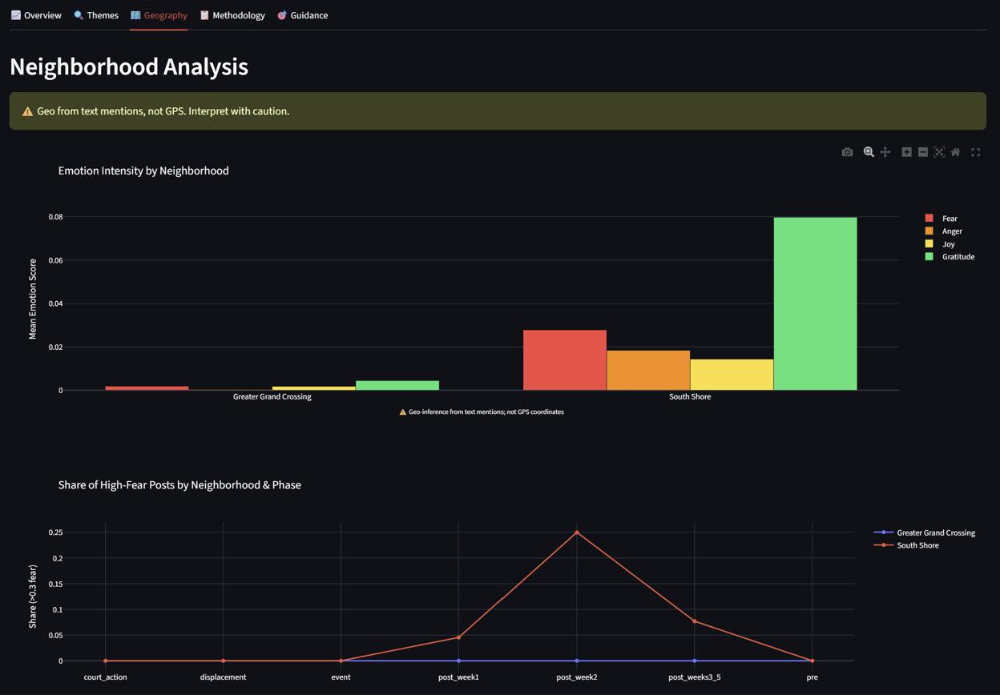
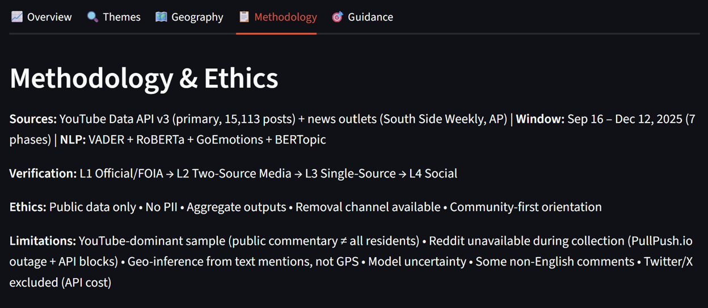
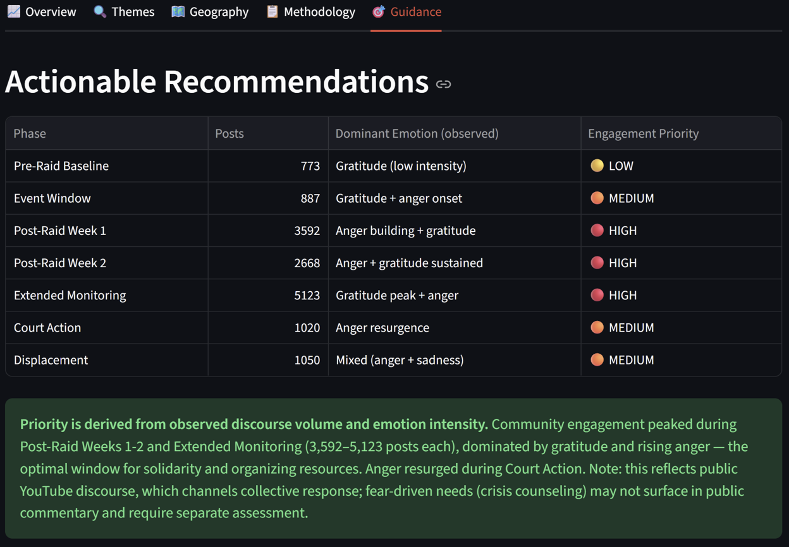

# South Shore Sentiment Study

[](https://python.org)
[](LICENSE)
[](.github/workflows/ci.yml)

**What did people feel, and when, as a Chicago community lived through an ICE raid and its 88-day aftermath? This project reads 15,000+ real online comments and turns them into a clear emotional timeline that community organizations can act on.**

---

## The Problem

On September 30, 2025, federal agents raided a 130-unit apartment building in Chicago's South Shore neighborhood. Over the next three months, residents faced ransacked homes, a court-ordered building clearance, and finally eviction.

Community groups, legal aid teams, and counselors wanted to help — but they had no way to know *what people were actually feeling* or *when*. Should they send crisis counselors first, or organizers? When does fear fade and solidarity take over? Without data, these decisions were guesswork.

## What I Built

A tool that:

1. **Collects** real public comments about the raid (from YouTube and news sites)
2. **Reads** each comment to detect its emotion — fear, anger, gratitude, joy, pride, sadness
3. **Tracks** how those emotions changed across 7 time periods, from before the raid through the eviction
4. **Shows** the results in an interactive dashboard with clear recommendations for when to deploy different kinds of help

## What I Found

I analyzed **15,113 real comments** from across the 88-day window. The results were surprising:

- **Solidarity, not fear, dominated the conversation.** Gratitude was the most common emotion — people expressing support for the affected residents. This suggests public comment sections act as a place for *collective support*, not private fear.
- **Anger built over time, peaking during the organizing weeks** (Weeks 1–5 after the raid) and flaring again when the court ordered the building cleared.
- **Fear stayed low throughout.** The people directly experiencing fear during the raid weren't the ones commenting weeks later online — an important reminder that public data captures the community *around* a crisis, not always those *inside* it.

**The takeaway for organizations:** Public discourse is dominated by solidarity and anger, which means the strongest opportunity is supporting community organizing during the high-engagement weeks (Weeks 1–5). Fear-driven needs like crisis counseling won't show up in public comments and need to be assessed separately.

---

## See It Yourself

### The emotional timeline


### What people talked about


### Which neighborhoods came up


### How the analysis was done


### Recommendations for action


---

## How It Works

```
COLLECT                  READ                    SHOW
───────                  ────                    ────
YouTube comments    →    Detect sentiment   →    Interactive dashboard
News articles            Detect 8 emotions       Emotion timeline
                         Find topics             Recommendations
                         Tag time periods        Excel + PDF reports
```

**The tools doing the reading:**

| Step | Tool | What it does |
|------|------|--------------|
| Sentiment | VADER + RoBERTa | Is a comment positive, negative, or neutral? |
| Emotion | GoEmotions | Which of 8 emotions does it express? |
| Topics | BERTopic | What themes are people discussing? |
| Storage | DuckDB → PostgreSQL | Organize results for fast querying and dashboards |

---

## Try It Yourself

You can run the whole thing on your own machine. By default it uses **sample data** so you don't need any API keys to see how it works.

```bash
# 1. Get the code
git clone https://github.com/YOUR_USERNAME/south-shore-sentiment-study.git
cd south-shore-sentiment-study

# 2. Set up Python
python -m venv .venv
source .venv/bin/activate        # Windows: .venv\Scripts\activate

# 3. Install everything
pip install -r requirements.txt
pip install -e .
python -m spacy download en_core_web_sm

# 4. Run the full pipeline (uses sample data)
python -m src.ingestion.pipeline --mode synthetic
python -m src.analysis.cleaning
python -m src.analysis.sentiment
python -m src.analysis.emotions
python -m src.analysis.topics
python -m src.analysis.longitudinal

# 5. Open the dashboard
streamlit run dashboards/app.py
```

The dashboard opens at `http://localhost:8501`.

### Want to use real data?

Add a free YouTube Data API key to a `.env` file:

```
YOUTUBE_API_KEY=your_key_here
```

Then run with `--mode live` instead of `--mode synthetic` in step 4. The collector pulls real comments from YouTube and news sites about the event.

---

## What's Inside

```
south-shore-sentiment-study/
├── dashboards/app.py      # The interactive dashboard
├── src/
│   ├── ingestion/         # Collects comments from YouTube & news
│   ├── analysis/          # Reads sentiment, emotion, topics
│   ├── visualization/     # Builds the charts
│   └── exports/           # Excel & PDF reports
├── sql/                   # Database setup + analytical queries
├── tests/                 # Automated tests
└── requirements.txt       # Everything needed to run it
```

---

## Skills Demonstrated

**Data Engineering:** Multi-source collection (APIs + web scraping), rate limiting, deduplication, data quality filtering, DuckDB → PostgreSQL pipeline

**NLP / Machine Learning:** Sentiment analysis (VADER, RoBERTa), emotion classification (GoEmotions), topic modeling (BERTopic), processing 15,000+ documents

**SQL / Databases:** Star schema design (fact + dimension tables), analytical views, window functions, CTEs

**Visualization:** Interactive Streamlit dashboard, Plotly charts, Excel and PDF report generation

**Engineering Practices:** Automated tests (pytest), continuous integration (GitHub Actions), clean project structure

---

## Honest Notes & Limitations

This project analyzes **public YouTube comments**, which shapes what it can and can't tell you:

- **It captures the conversation *around* the event, not always the people *inside* it.** Those most directly affected may not comment publicly. Public discourse skewed toward solidarity and anger; private fear and crisis needs require different data sources.
- **YouTube was the main source.** Reddit collection failed during this run (the archive service was down and Reddit blocks automated access), so this is primarily a YouTube study with a small amount of news data. Twitter/X was excluded due to API costs.
- **Location data is limited.** Only 84 of 15,113 comments mentioned a specific neighborhood — people rarely name exact locations in comments. Geographic findings are directional, not precise.
- **AI models aren't perfect.** Sentiment and emotion detection have inherent error rates. Some non-English comments appeared in the data.

**Ethics:** Only public comments were used. No personal information was collected or published. All results are shown as aggregate trends, never individual comments.

---

## What I'd Do Next

1. **Add Reddit data** when the archive service is available — it has richer local discussion and would enable platform comparison
2. **Validate the AI models** by hand-labeling a sample of comments to measure accuracy
3. **Build a Power BI dashboard** on top of the PostgreSQL database for enterprise reporting
4. **Add live monitoring** so the analysis can run continuously for future events

---

## License

MIT — see [LICENSE](LICENSE)
